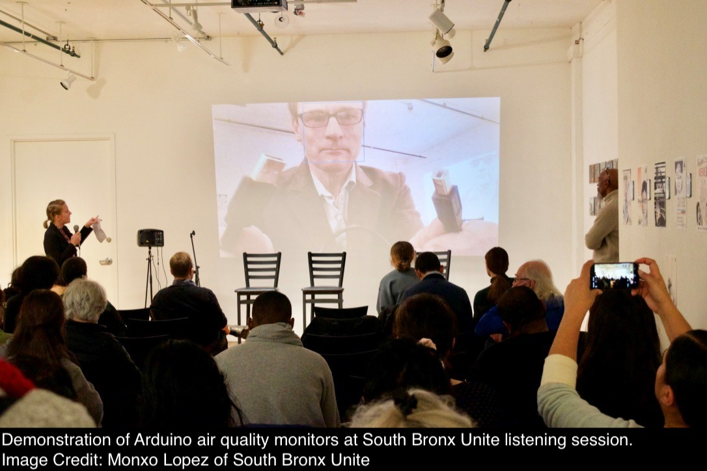
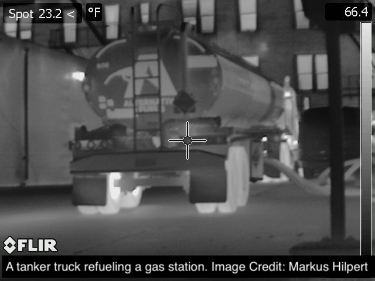
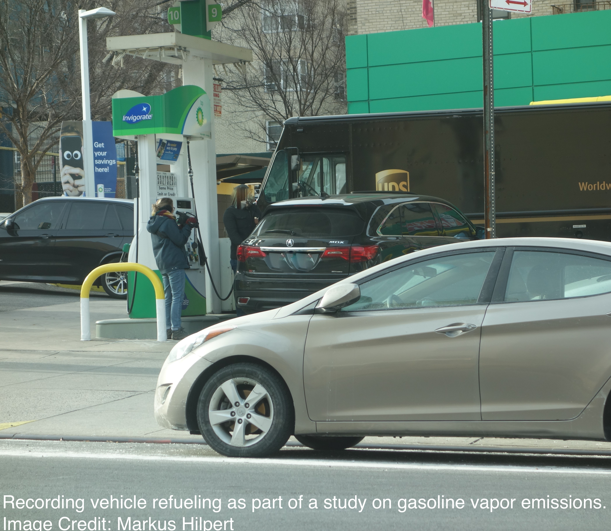

***

 

#### **Traffic-Related Air Pollution**

Air pollution from traffic is a pernicious exposure globally, and has been tied to numerous negative health outcomes. I am interested in studying the impact of policies (such as stay-at-home orders, or road tolls) or events (the opening of a warehouse) on traffic, traffic-related air pollution, and health outcomes. In particular, it is critical to evaluate how changes in traffic impact disadvantaged communities and to partner with communities to collect hyper-local data and investigate traffic and air pollution changes in response to municipal policies.

###### *The South Bronx*

Partnering with [South Bronx Unite](https://www.southbronxunite.org), we are actively monitoring traffic and air pollution in the Mott Haven and Port Morris communities. Continued industrial  development in these neighborhoods has increased traffic, potentially contributing to the already high burden of childhood asthma. For this project, we aim to: (1) measure traffic changes over time, (2) assess traffic related air pollution, and (3) increase capacity for community monitoring. 

 

* Select Publications:
  + [Opening a Large Delivery Service Warehouse in the South Bronx: Impacts on Traffic, Air Pollution, and Noise](https://www.mdpi.com/1660-4601/17/9/3208)
  + [Social-distancing Fatigue: Evidence from Real-time Crowd-sourced Traffic Data](https://www.sciencedirect.com/science/article/pii/S0048969721034070)

 

#### **Menstruation and Environmental Health**

Menstruation is a vastly understudied health process in environmental health. I am interested in understanding how menstruation is related to chemical exposures and excretion, and how this could impact health. For example, tampons, which are composed of cotton and rayon, can contain contaminants such as metals and endocrine disrupting chemicals. Additionally, menstruation is likely an excretion route for PFAS in the body. 

We are currently measuring concentrations of various pesticides and metals in a selection of popular US tampon brands, and are conducting an epidemiologic study of the relationship between tampon use metals in the Study of Environment, Lifestyle, and Fibroids (SELF)  cohort. 

* Publications: 
  + [Menstrual Products as a Source of Environmental Chemical Exposure: A Review from the Epidemiologic Perspective](https://pubmed.ncbi.nlm.nih.gov/35302185/)
  + [An Epidemiologic Review of Menstrual Blood Loss as an Excretion Route for Per- and Polyfluoroalkyl Substances](https://pubmed.ncbi.nlm.nih.gov/35267175/)

 

#### **Exposures at Gas Stations**  

Gas stations are sources of exposure for numerous dangerous chemicals and mixtures, including vehicle exhaust, vaporized fuel, and liquid fuel, which contain harmful aromatics (benzene, toluene) and other chemicals (black carbon, particles). Individuals can be exposed to these mixtures when they refuel their vehicles, work at gas stations, or happen to live or work in close proximity to a gas station. At particular risk are the thousands of employees who work as gas station attendants pumping gas for customers, for example in the state of New Jersey, where self-service is illegal. Despite these risks, there is limited knowledge on exposures and potential health impacts at gas stations, especially in the United States. The goals of this project are (1) to quantify exposures to gasoline from typical vehicle refueling at gas stations using a number of environmental monitoring methods, (2) to estimate exposures to gasoline from venting through underground storage tank vent pipes, and (3) to quantify exposures to fuel vapor from various sources at gas stations.  

  * Publications:   
    + [Gasoline Vapor Emissions During Vehicle Refueling Events in a Vehicle Fleet Saturated with Onboard Refueling Vapor Recovery Systems: Need for an Exposure Assessment](https://www.ncbi.nlm.nih.gov/pmc/articles/PMC7020915/)  
    + [Benzene Emissions from Gas Station Clusters: A New Framework for Estimating Lifetime Cancer Risk](https://www.ncbi.nlm.nih.gov/pmc/articles/PMC8172828/)  
 

 

