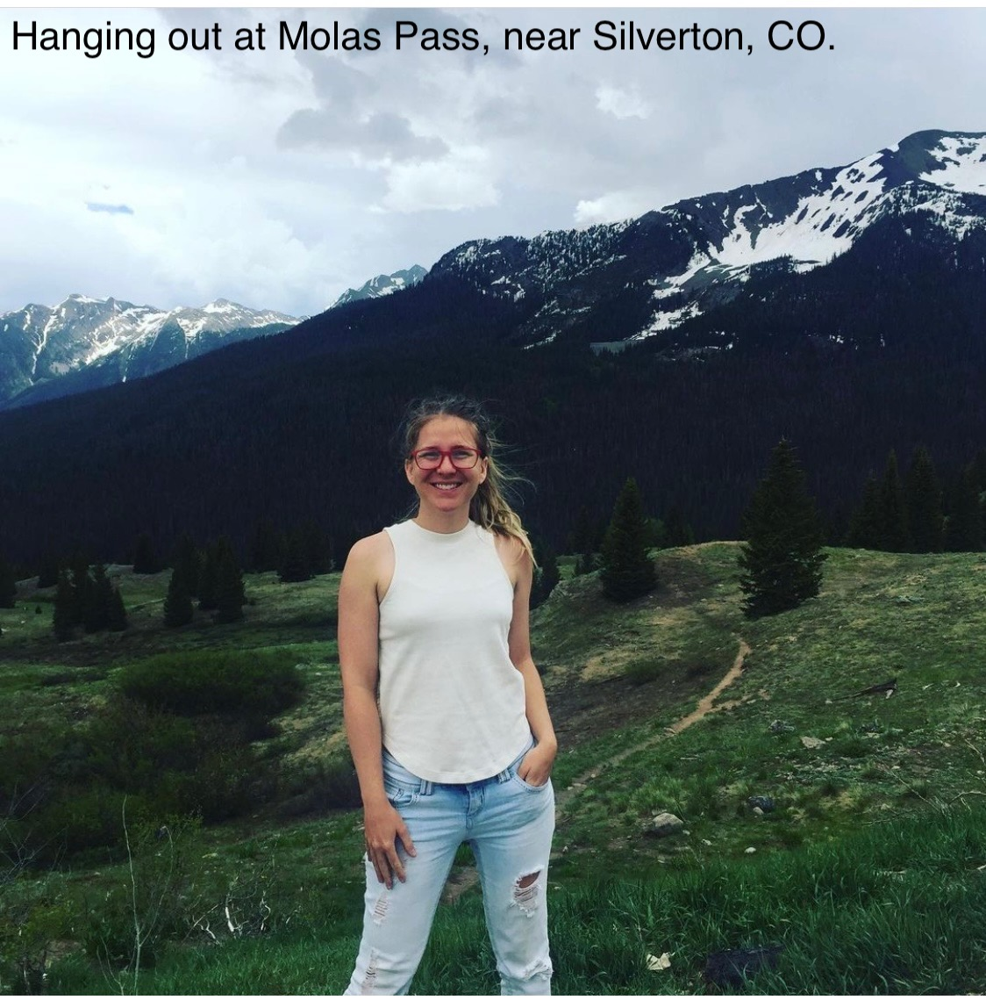

***

#### About Me

I'm originally from a small town in the San Juan Mountains of Colorado called [Pagosa Springs](https://visitpagosasprings.com/index.php), which is home to some really beautiful hot springs (the deepest known in the world!). I enjoy hiking the mountains and exploring nature - if you find yourself in CO, and driving through I-70, I recommend stopping to hike [Hanging Lake](https://www.fs.usda.gov/recarea/whiteriver/recarea/?recid=41225)!

 

In our spare time, my partner and I enjoy growing flowers on our terrace. This year we've expanded the variety and types of flowers and plants - although vining mandevilla may be our favorite. 

 

#### Books

I've always been an avid reader, and currently I'm on a sci-fi kick. One of my new favorites is the [Murderbot Diaries](https://marthawells.com/murderbot.htm) series by Martha Wells. The protagonist is a human/AI combination who is newly learning to see itself as a person, and trying to figure out what it wants from life, all while consuming copious amounts of entertainment media. I highly recommend if you enjoy  fast-paced action and a good-hearted, endearing character.

In the realm of environmental health, I recommend two books that altered my thinking: [Tom's River](https://www.danfagin.com/website/books/#tomsriver) by Dan Fagin, and [Chasing the Scream](https://chasingthescream.com) by Johann Hari. Tom's River tells the story of a chemical manufacturing plant, its pollution of nearby Tom's River, an ensuing cancer cluster, and the science and activism surrounding the event. Chasing the Scream dives deep into the experience of drug addiction and treatment, humanizing people who struggle with addiction and thoughtfully critiquing the systems we have (and do not have) for supporting them. 

***
