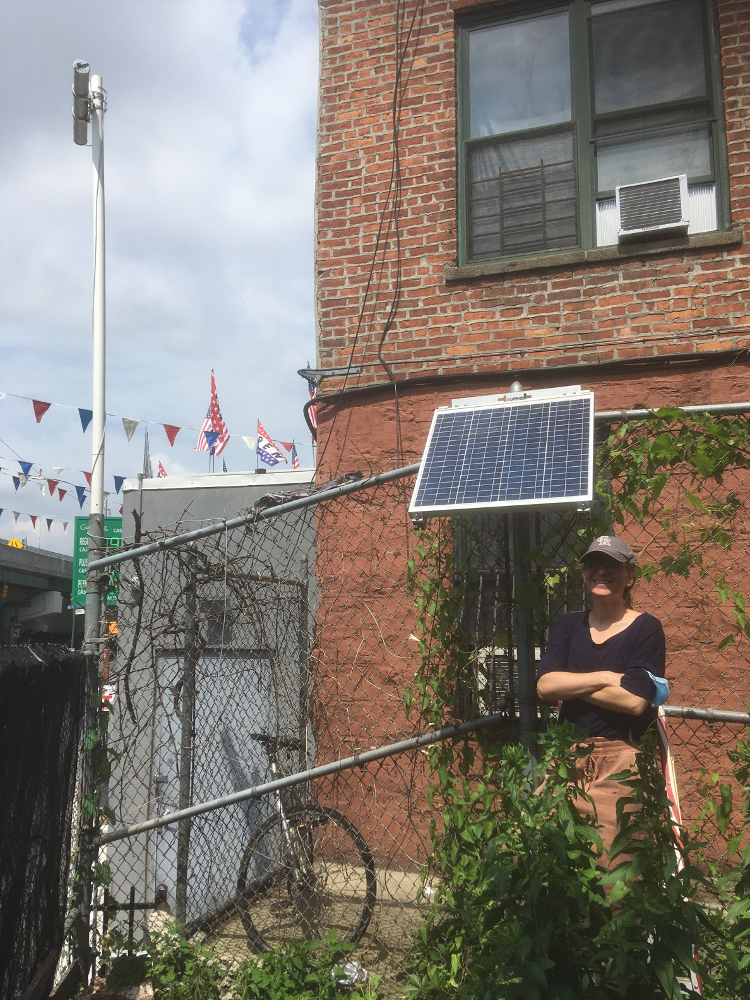

***

 

 

**Hello!** I'm an environmental epidemiologist with an interest in  environmental monitoring, environmental justice, and community/science partnerships. During my public health career, I've worked on numerous projects in the United States and abroad, ranging from measuring volatile organic compound emissions at gas stations in the US to developing epidemiologic surveys to measure smoking rates in the United Arab Emirates. My work has focused primarily on outdoor and indoor air pollution, including exposure to air pollutants from traffic, gas stations, and petroleum sources, as well as indoor pollutants like secondhand exposure to hookah, cigarettes, or electronic cigarettes. Recently, I've began studying the intersection of menstruation and environmental health, and am particularly interested in understanding how menstruation might be a route of exposure to environmental chemicals (for example expsoure to pesticides through use of cotton tampons) and an excretion route (for example of PFAS in blood). 

 

I am currently searching for a postdoc position. If you have any available openings, please feel free to message me at [js5431.@cumc.columbia.edu](mailto:<js5431@cumc.columbia.edu>) 

 
 

#### **[CV](Curriculum Vitae 06.01.19.pdf)**
#### **[Google Scholar](https://scholar.google.com/citations?hl=en&user=eHtRF7EAAAAJ)**

 
 

***

